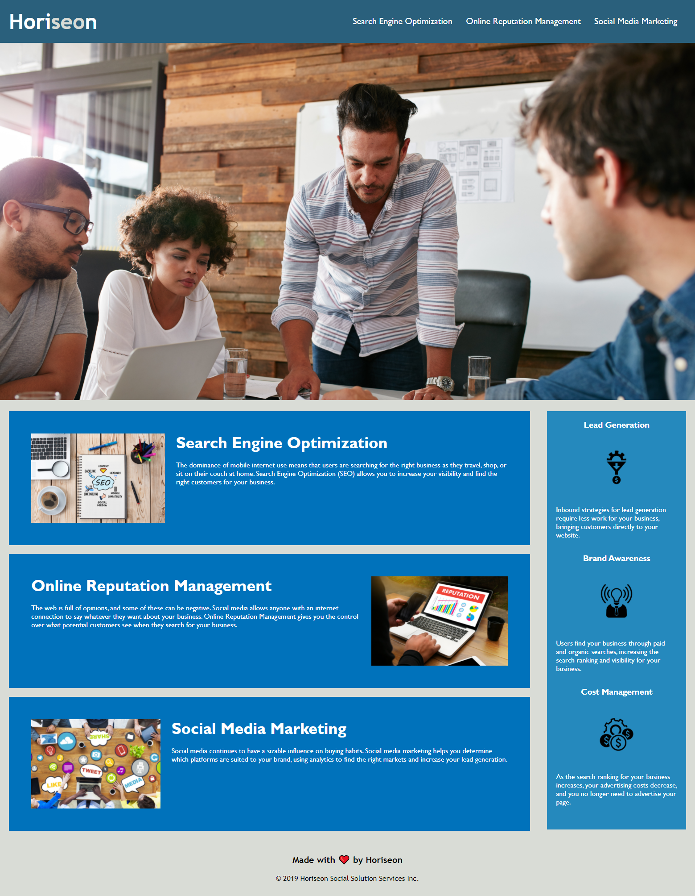

# Horiseon-Accessibility-Project

## Description:
Creating a mock-up site for Horiseon and ensuring accessibility for all users.    

Examples of changes include:
<ul>
<li> Creating a descriptive and concise title</li>
<li> Fixed broken navigation for an internal link </li>
<li> Changed repetive 'div' tags to alternative HTML elements (e.g., section, nav, articles, etc.) </li>
<li> Changed formatting in css stylesheet in order to better mirror html index</li>
<li> Added comments to box indev and stylesheet for future authors/users</li>
<li> Alternative text was added to each image for enhanced accessibility</li>
<br>

## User Story:

```
AS A marketing agency
I WANT a codebase that follows accessibility standards
SO THAT our own site is optimized for search engines
```

## Acceptance Criteria:

```
GIVEN a webpage meets accessibility standards
WHEN I view the source code
THEN I find semantic HTML elements
WHEN I view the structure of the HTML elements
THEN I find that the elements follow a logical structure independent of styling and positioning
WHEN I view the icon and image elements
THEN I find accessible alt attributes
WHEN I view the heading attributes
THEN they fall in sequential order
WHEN I view the title element
THEN I find a concise, descriptive title
```
## Website Screenshot:



## Links:

<strong> Github: </strong> https://github.com/laurelthorburn/Horiseon-Accessibility-Project.git

<strong> Deployed Site:</strong> https://laurelthorburn.github.io/Horiseon-Accessibility-Project
