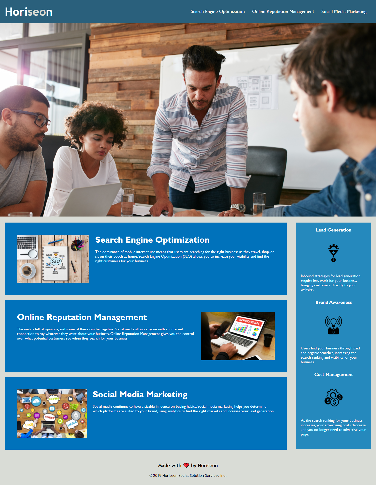

# Horiseon-Accessibility-Project

## Description:
Creating a mock-up site for Horiseon and ensuring accessibility for all users.    

Examples of changes include:
<ul>
<li> Creating a descriptive and concise title</li>
<li> Fixed broken navigation for an internal link </li>
<li> Changed repetive 'div' tags to alternative HTML elements (e.g., section, nav, articles, etc.) </li>
<li> Changed formatting in css stylesheet in order to better mirror html index</li>
<li> Added comments to box indev and stylesheet for future authors/users</li>
<li> Alternative text was added to each image for enhanced accessibility</li>
 

## Website Screenshot:

## Links:

<strong> Github: </strong> https://github.com/laurelthorburn/Horiseon-Accessibility-Project.git

<strong> Deployed Site:</strong> https://laurelthorburn.github.io/Horiseon-Accessibility-Project/
